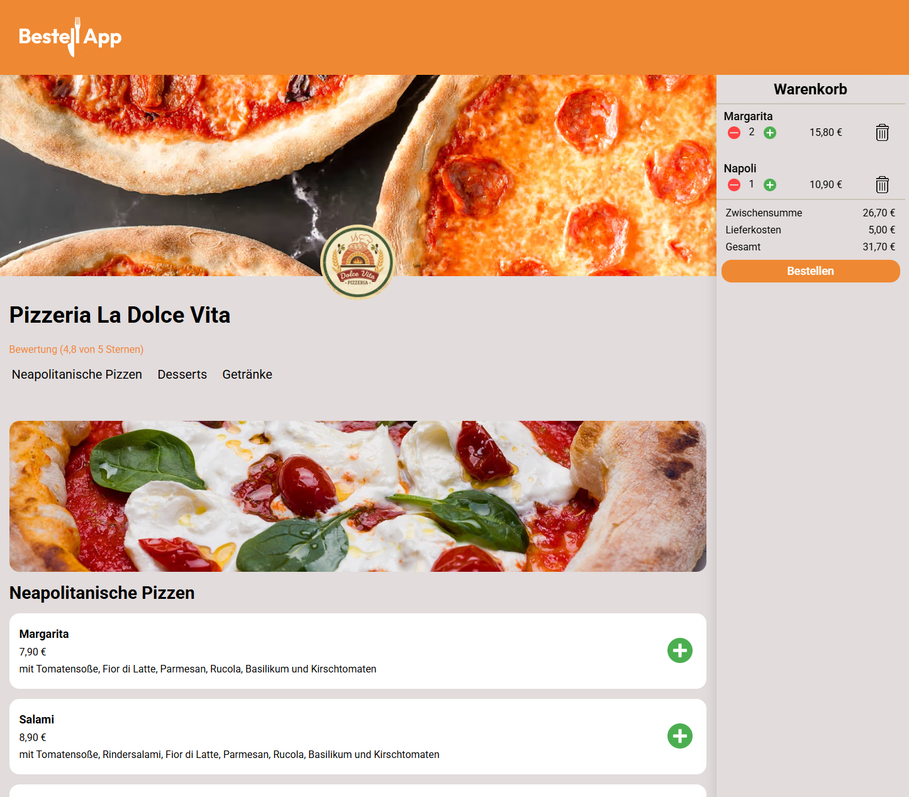

# 🍕 BestellApp

A food ordering app concept inspired by delivery platforms like Lieferando, built with vanilla JavaScript.

👉 **[Open the App](https://benjaminblarr.dev/Bestellapp/)**

## 📌 About
BestellApp is a fully functional food ordering interface where users can browse a restaurant menu, add items to their cart and see a live order summary. Built as a practice project to deepen skills in DOM manipulation and dynamic rendering.

## ✨ Features
- Dynamic menu rendering from JavaScript data objects
- Add, remove and update items in the shopping cart
- Live cart summary with subtotal, delivery costs and total
- Clean and responsive UI

## 🛠️ Technologies

